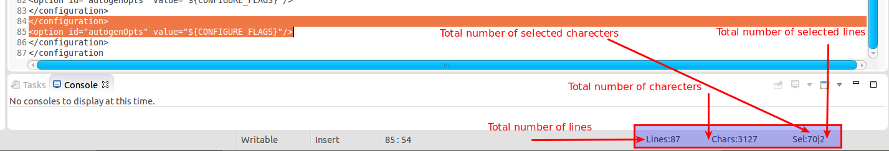
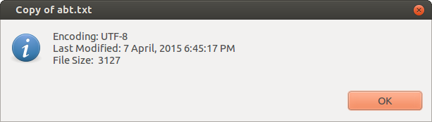

# chandrayya-eclipse-plugins
Here you find some eclipse plugins. Set of related plugins are developed as features. You can install single or selected or all features.

<h2>Installation</h2>

A) Install from source.

Requires the use of the Eclipse Plug-in Development Tools(https://eclipse.org/pde/)

<ul class="task-list">
<li>Load the source into your workspace;</li>
<li>Select "Export &gt; Deployable plug-ins and fragments";</li>
<li>Mark the checkbox next to the org.eclipselabs.windowsizer plug-in;</li>
<li>Select "Install into host"</li>
<li>Click "Finish"</li>
</ul>

B) Install from command line

<pre>
git clone https://github.com/chandrayya/chandrayya-eclipse-plugins.git
cd com.chandrayya.master
mvn clean install
cd chandrayya-eclipse-plugins/com.chandrayya.updatesite/target/repository
</pre>
Confirm if updatesite site is generated.

Open eclipse click Help > Install New software
Click Add button. In the Add repository dialog click Local button and select "<Cloned folder>/chandrayya-eclipse-plugins/com.chandrayya.updatesite/target/repository"

Further follow the instructions in update wizard.

C) Download update site archive

Download updatesite archive file (chandrayya-plugins-<Timestamp>.zip)from here
https://drive.google.com/open?id=0B3pxBGD-v-ycdXVIRkttemdTOU0&authuser=0

Open eclipse click Help > Install New software
Click Add button. In the Add repository dialog click Archive button and select the download archive file.

Further follow the instructions in update wizard.

<h2>Features</h2>
<h3>Edit Plus Minus</h3>
<ul>
<li>Automatically copies the selected text to clipboard</li>
By default autocopy is switched off. Enable this option in `Windows > Preferences > Chandrayya Plugins`
<li>Shows total number of lines, charecters, selected lines, selected charecters, file size of a opened file in status bar
  

  
Double clicking on the status bar will do file details
  

</ul>
